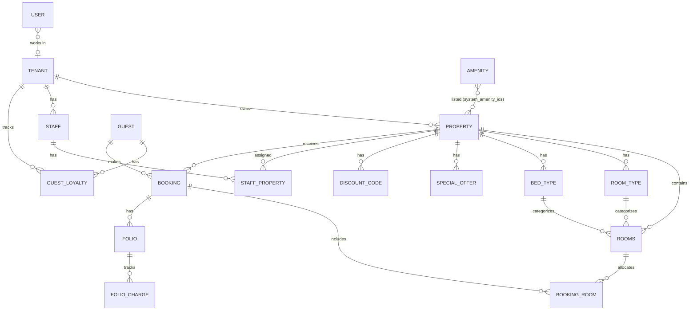

# StayEasy API — Project Documentation

## 1. Project Overview

**StayEasy API** is a multi-tenant property-management & booking backend built with **FastAPI**. It powers two broad use cases:

- A **Property Management System (PMS)** where admins/tenants manage properties, rooms (room types, bed types), special offers, discount codes, staff, and image uploads.
- A **Guest-facing booking flow** where guests register, search properties, create reservations, apply discounts/coupons, and pay through multiple payment gateways.

The application is structured as a modular **monolith** with a clean layered architecture:

```
Router (HTTP) → Dependency (injection) → Service (business logic) → Repository (SQL) → ORM Model
```

Key characteristics:

- **API prefix:** `/api/v1` (set via `root_path` in the FastAPI app)
- **App title/version:** `StayEasy API` v `1.0.0`
- **Python:** >= 3.12, managed with `uv`
- **Database:** PostgreSQL (async SQLAlchemy 2.0); SQLite + `aiosqlite` for tests
- **Cache/Session store:** Redis (OTP storage, search caching, booking soft-locks, forex rate cache)
- **Migrations:** Alembic (7 revisions)
- **Tests:** `pytest` + `pytest-asyncio` + `fakeredis` (SQLite in-memory)

---

## 2. Tech Stack & Key Dependencies

| Category | Library |
|---|---|
| Web framework | `fastapi[standard]`, `uvicorn[standard]` |
| ORM | `sqlalchemy` (async), `greenlet` |
| DB drivers | `psycopg[binary]` (PostgreSQL), `aiosqlite` (tests) |
| Geospatial | `geoalchemy2` |
| Migrations | `alembic` |
| Cache / sessions | `redis` (async client) |
| Auth / security | `pyjwt`, `pwdlib[argon2]` |
| Validation | `pydantic` v2 |
| Payments | `stripe`, `razorpay`, `cloudinary`, Resend (email) — Khalti via raw `httpx` |
| Email | `resend` (API via `httpx`) |
| Image handling | `pillow`, `aiofiles`, `cloudinary` |
| HTTP client | `httpx` |
| Misc | `python-dotenv`, `tzdata` |

Notable design choices:

- **Strategy + Factory pattern** for payment gateways (`PaymentStrategy` interface → Stripe/Razorpay/Khalti/Dummy implementations, selected by `PaymentServiceFactory`).
- **Strategy pattern** for image storage (`ImageStorageStrategy` → `LocalImageStorage` / `CloudinaryImageStorage`, picked by `StorageFactory` via `IMAGE_STORAGE_PROVIDER`).
- **Idempotency keys** for booking creation and payment confirmation (Redis-backed to guarantee at-most-once processing).
- **Redis soft-locks** prevent double-booking of rooms by holding a reservation window with TTL (`SOFT_LOCK_TTL_SECONDS`).

---

## 3. Architecture & Project Structure

```
stay-easy/
├── app/
│   ├── main.py                      # FastAPI app, lifespan (expiry job), router mounting
│   ├── config/
│   │   ├── database_config.py       # async engine, session factory, Base, get_db
│   │   └── redis_config.py          # Redis connection pool + get_redis_client
│   ├── utils/
│   │   ├── cache.py                 # build_cache_key, get_cached, set_cached (fail-open)
│   │   ├── cors.py                  # CORS middleware
│   │   ├── exceptions.py           # centralized exception hierarchy
│   │   ├── exception_handlers.py   # FastAPI global handlers
│   │   ├── expiry_loop.py          # background stale-booking cleanup job
│   │   ├── forex.py                # NRB exchange rate → NPR (with retries + cache)
│   │   ├── image_utils.py          # image processing helpers
│   │   ├── logging.py              # LoggerFactory (stdlib logging)
│   │   ├── nested_mutable.py       # JSONB mutation tracking
│   │   ├── schemas.py              # StandardResponse envelope
│   │   ├── timestamp.py            # TimestampMixin
│   │   ├── url_validation.py      # Khalti return-URL validation
│   │   ├── validation.py           # verify_tenant helper + validators
│   │   └── forex / ...             # (see modules)
│   └── modules/
│       ├── auth/     (models, repositories, routers, schemas, services, dependencies, auth_middlewares)
│       ├── pms/      (models, repositories, routers, schemas, services, storage, validation, dependencies)
│       ├── booking/  (models, repositories, routers, schemas, services, payment/, dependencies)
│       └── staff_mgmt/ (models, repositories, routers, schemas, services, dependencies)
├── alembic/                     # Alembic migrations
├── tests/                       # pytest suite (SQLite + fakeredis)
├── alembic.ini
├── pyproject.toml
├── pytest.ini
├── requirements.txt
```

All API responses follow the generic envelope:

```json
{
  "success": true,
  "data": { ... },
  "meta": { "total": 0, "skip": 0, "limit": 10, "has_more": false }
}
```

### 3.1 Data Flow Diagram (DFD)

```mermaid
flowchart LR
    subgraph Clients
        G[Guest / Consumer App]
        A[Admin / Tenant App]
    end

    subgraph StayEasy API
        direction LR
        G -->|REST /api/v1| ROUTER[FastAPI Routers]
        A -->|REST /api/v1| ROUTER

        ROUTER --> DEP[DI Dependencies]
        DEP --> SVC[Services]
        SVC --> REPO[Repositories]
        REPO --> DB[(PostgreSQL)]

        SVC --> CACHE[(Redis)]
        SVC --> MAIL[Resend Email API]
        SVC --> IMG[Image Storage<br/>Local / Cloudinary]

        subgraph Payments
            SVC --> PS[PaymentService]
            PS --> PF[PaymentServiceFactory]
            PF --> ST[Stripe]
            PF --> RZ[Razorpay]
            PF --> KH[Khalti + NRB Forex]
            PF --> DU[Dummy]
        end

        ROUTER --> IMGR[Image Routers]
        IMGR --> IMGSVC[ImageService]
        IMGSVC --> IMG

        background job: EC[Expiry Loop (asyncio task)]
        EC --> DB
        EC --> REDIS[(Redis)]
    end
```

---

## 4. Modules & Endpoints

### 4.1 Authentication (`/auth`)

| Method | Path | Auth | Description |
|---|---|---|---|
| POST | `POST /auth/users/register` | – | Register an admin/user (email OTP sent via Resend) |
| POST | `POST /auth/users/verify-otp` | – | Verify registration OTP for users |
| POST | `POST /auth/users/resend-otp` | – | Resend user verification OTP |
| POST | `POST /auth/users/refresh` | – | Refresh user access token |
| GET  | `GET /auth/users/me` | User | Current user profile |
| POST | `POST /auth/guests/register` | – | Register a guest (email OTP) |
| POST | `POST /auth/guests/verify-otp` | – | Verify guest OTP |
| POST | `POST /auth/guests/resend-otp` | – | Resend guest OTP |
| POST | `POST /auth/guests/refresh` | – | Refresh guest access token |
| GET  | `GET /auth/guests/me` | Guest | Current guest profile |
| POST | `POST /auth/login` | – | Login (OAuth2 form) — tries guest then user |

Auth implementation details:
- Passwords hashed with **Argon2** (`pwdlib.recommended()`).
- **JWT** access token (`exp`) + refresh token (`sub`, `role`) using `PyJWT`.
- OTPs stored in **Redis** under keys like `auth:otp:{email}` with configurable TTL (`OTP_EXPIRATION_SECONDS`).
- Development mode has a **master OTP** (`DEVELOPMENT_MASTER_OTP`, default `123456`) and bypasses Resend (prints OTP to logs).

### 4.2 Tenants (`/tenants`)

| Method | Path | Auth | Description |
|---|---|---|---|
| GET | `/tenants/` | User | Get current user's tenant |
| POST | `/tenants/` | User | Create a tenant |
| PATCH | `/tenants/` | User | Update tenant |
| DELETE | `/tenants/` | User | Delete tenant |

A user can create the tenant that they own (updates `users.tenant_id`). Tenant slug is unique.

### 4.3 Properties (`/properties`)

| Method | Path | Auth | Description |
|---|---|---|---|
| GET | `/properties/` | User | List tenant's properties (paginated) |
| GET | `/properties/amenities` | User | List system amenities |
| POST | `/properties/general-information` | User | Create property general info |
| GET | `/properties/{id}` | User | Get property by id |
| PATCH | `/properties/{id}` | User | Update property |
| DELETE | `/properties/{id}` | User | Delete property |
| GET | `/properties/{id}/public` | – | Get property (public) |
| POST | `/properties/{id}/create-location` | User | Set location (with lat/lng, geo columns) |
| POST | `/properties/{id}/create-photos-and-amenities` | User | Set photos + amenities |
| POST | `/properties/{id}/create-localization` | User | Set localization (currency/timezone/language etc.) |
| POST | `/properties/{id}/create-brand-visual` | User | Set brand logo + color |
| POST | `/properties/{id}/toggle-property-activation` | User | Toggle `is_active` |
| GET | `/properties/{id}/number-of-floors` | User | Get number of floors |
| GET | `/properties/{id}/bookings` | User | List property bookings (paginated) |

### 4.4 Rooms (`/properties/{property_id}/rooms`)

| Method | Path | Auth | Description |
|---|---|---|---|
| GET | `/properties/{property_id}/rooms` | User | List rooms (filter by status/floor, paginated) |
| POST | `…/rooms` | User | Bulk-create rooms |
| POST | `…/rooms/room-type` | User | Create a room type |
| POST | `…/rooms/bed-type` | User | Create a bed type |
| GET | `…/rooms/room-types` | User | List room types |
| GET | `…/rooms/bed-types` | User | List bed types |
| GET | `…/rooms/available-rooms` | – | Available rooms for date range (public) |
| GET | `…/rooms/{room_id}` | User | Get room |
| PATCH | `…/rooms/{room_id}` | User | Update room |
| DELETE | `…/rooms/{room_id}` | User | Delete room |

Room cancellation policy uses a **hybrid storage**: enum (`FLEXIBLE / MODERATE / STRICT / NON_REFUNDABLE / CUSTOM`) + `cancellation_title` and `cancellation_description` snapshots. Room/bed types can be **global defaults** (`property_id IS NULL`, `is_default = true`) or **property-specific**.

### 4.5 Images (`/properties/{property_id}/images`)

| Method | Path | Auth | Description |
|---|---|---|---|
| POST | `…/images` | User | Bulk upload property images (max 5) |
| POST | `…/rooms/images` | User | Bulk upload room images |
| POST | `…/image` | User | Single property image |
| POST | `…/staffs/image` | User | Single staff image |
| POST | `…/rooms/image` | User | Single room image |

All uploads enforce `image/*` mime-type, convert to **webp**, store under `temp/…` folder paths on **Cloudinary** (or local disk). Cloudinary cleanup sweep for >24 h temp assets exists in `clean_old_temp_images()`.

### 4.6 Special Offers (`/properties/{property_id}/special-offers`)

| Method | Path | Auth | Description |
|---|---|---|---|
| POST | `…/special-offers/` | User | Bulk-create offers |
| GET | `…/special-offers/` | User | List offers (paginated) |
| GET | `…/special-offers/{offer_id}` | User | Get offer |
| PATCH | `…/special-offers/{offer_id}` | User | Update offer (also validates room cursor) |
| DELETE | `…/special-offers/{offer_id}` | User | Delete offer |

### 4.7 Discount Codes (`/properties/{property_id}/discount-codes`)

| Method | Path | Auth | Description |
|---|---|---|---|
| POST | `…/discount-codes/` | User | Create discount code (FIXED or PERCENTAGE) |
| GET | `…/discount-codes/` | User | List codes (paginated) |
| GET | `…/discount-codes/{id}` | User | Get code |
| PATCH | `…/discount-codes/{id}` | User | Update code |
| DELETE | `…/discount-codes/{id}` | User | Delete code |

### 4.8 Staff Management (`/properties/{property_id}/staffs`)

| Method | Path | Auth | Description |
|---|---|---|---|
| POST | `…/staffs` | User | Create staff (role, salary, photos) |
| GET | `…/staffs` | User | List staff (paginated) |
| GET | `…/staffs/{staff_id}` | User | Get staff |
| PATCH | `…/staffs/{staff_id}` | User | Update staff |
| DELETE | `…/staffs/{staff_id}` | User | Delete staff |

### 4.9 Search (`/search`)

| Method | Path | Auth | Description |
|---|---|---|---|
| GET | `/search` | – | Search properties by destination (fuzzy match), date range, adults/children/rooms; paginated; Redis-cached for popular destinations |
| GET | `/search/nearby` | – | Nearby properties within radius from lat/lon, with distance and lowest rate (max 20) |

Search pipeline: fuzzy match properties by destination → fetch date-available rooms → capacity filter → price aggregation (best+cheapest) → property detail enrichment (cover photo, amenities) → pagination.

### 4.10 Bookings & Payments (`/bookings`)

| Method | Path | Auth | Description |
|---|---|---|---|
| POST | `/bookings/` | Guest | Create booking (reservation): validates dates, room capacity, availability; computes subtotal, applies special offers; stores `ref_number` like `BK-XXXX`; soft-locks rooms in Redis |
| POST | `/bookings/{ref_number}/payment-intent` | Guest | Create payment intent for chosen gateway (Stripe/Razorpay/Khalt/Dummy); Khalti requires return URL |
| POST | `/bookings/{ref_number}/confirm` | Guest | Confirm booking after payment verified (idempotent; expires if hold expired → refund attempt) |
| POST | `/bookings/{ref_number}/apply-discount` | Guest | Apply coupon code (FIXED/PERCENTAGE, min-amount, max-uses) |
| GET | `/bookings/me` | Guest | Guest's bookings (paginated) |
| GET | `/bookings/{ref_number}` | Guest | Booking detail (owner-only) |

---

## 5. Payment Integration

- Abstract interface: `PaymentStrategy.create_payment_intent / verify_payment / refund`.
- `PaymentServiceFactory` returns strategy by gateway string: `STRIPE`, `RAZORPAY`, `KHALTI`, `DUMMY`.
- **Stripe**: SDK-backed intent creation.
- **Razorpay**: SDK-backed intent creation.
- **Khalti**: raw `httpx` calls to Khalti `/epayment/initiate/` (returns `pidx`, `payment_url`) and `/epayment/lookup/` for verification. Amounts converted to **NPR** (paisa) via `forex.convert_to_npr` (NRB FOREX API with 4 retries + Redis 6h cache). Refund/cancel are no-ops (manual via dashboard).
- **Dummy**: local success strategy for dev/test.
- **Idempotency**: booking creation & confirmation use Redis-based reserve semantics; a completed booking is reachable by the client idempotency key even after race conditions.
- **Stale booking expiry**: background `expiry_loop` deletes PENDING reservations older than `SOFT_LOCK_TTL_SECONDS`; a confirmed hold that expires before payment is refunded (attempted).

---

## 6. Data Model (Database Schema)

All tables use UUID primary keys and `TimestampMixin` (created_at/updated_at). Relationships and key columns below.

### Entity Relationship Overview



### Key Tables

| Table | Purpose | Notable columns |
|---|---|---|
| `users` | Admin/tenant accounts | `email` UNIQUE, `hashed_password`, `role`, `tenant_id` (FK, nullable) |
| `guests` | Global guest registry (cross-tenant SSO) | `email` UNIQUE, `password_hash`, `full_name`, `phone`, `nationality`, `is_active` |
| `guest_loyalty` | Cross-tenant loyalty profile | `guest_id`, `tenant_id`, `loyalty_tier`, `total_points`; UNIQUE(guest_id,tenant_id); `total_points >= 0` |
| `tenants` | Organizational workspace | `name`, UNIQUE `slug`, `owner_id` (FK users) |
| `properties` | Hospitality properties | `name`, `type` (HOTEL/HOSTEL/VILLA/APARTMENT/RESORT/GUESTHOUSE/RESTURANT/OTHER), address fields, `lat/long`, `check_in/out_time`, grace periods, `number_of_floors` (>=1), `total_rooms`, `year_built`, `currency`, `timezone`, photos JSONB, `system_amenity_ids` ARRAY, `custom_amenities` JSONB, `is_active` |
| `amenities` | Global amenities master | `name`, `icon` |
| `room_types` | Room type catalog (global or property-scoped) | `room_type_name`, `is_default` (with partial unique index on name when default) |
| `bed_types` | Bed type catalog (global or property-scoped) | `bed_name`, `is_default` |
| `rooms` | Physical rooms | `room_name` (UNIQUE per property), `max_adults` (1–30), `max_children` (0–15), `base_rate` (>0), `floor_number`, `status` (AVAILABLE/BLOCKED/BOOKED/CLEANING/DIRTY/OCCUPIED/INSPECTED/MAINTENANCE/OUT_OF_SERVICE), `cancellation_policy`, `cancellation_title`, `cancellation_description`, photos JSONB, amenity fields |
| `special_offers` | Promo campaigns | `title`, `description`, `discount_percentage` (0–100), `start_date`/`end_date`, `is_active`, `is_custom` |
| `discount_codes` | Promo codes | `code` (UNIQUE per property), `type` (FIXED/PERCENTAGE), `discount_value`, `min_amount`, `max_uses`, `used_count`, `valid_from`/`valid_to` |
| `staffs` | Property staff | `email` UNIQUE, `job_role` (MANAGER/FRONT_DESK/HOUSEKEEPING/WAITER/KITCHEN/MAINTENANCE), `monthly_salary`, `joining_date`, `status` (ACTIVE/INACTIVE/ON_LEAVE), photos JSONB |
| `staff_properties` | M:N staff–property assignment | UNIQUE(staff_id, property_id) |
| `bookings` | Reservation aggregates | `property_id`, `guest_id`, `status` (PENDING/CONFIRMED/CHECKED_IN/CHECKED_OUT/CANCELLED/EXPIRED), `payment_gateway` (STRIPE/RAZORPAY/KHALTI/DUMMY), `number_of_adults/children`, `checkin_date`/`checkout_date`, `total_amount`, `subtotal`, `special_offer_discount`, `coupon_code`, `coupon_discount`, UNIQUE `ref_number`; check `checkout > checkin`, `total >= 0` |
| `booking_rooms` | Booked room allocations | `booking_id` (CASCADE), `room_unit_id` (RESTRICT) |
| `folios` | Financial tracking cards per booking | status (OPEN/PARTIALLY_PAID/PAID/WAIVED), `subtotal`, `tax`, `discount`, `total`, `settled_at` |
| `folio_charges` | Itemized room/incidental charges | `description`, `amount`, `category`, `posted_by`, `posted_at` |

**(lore/discussion tables)** — all columns above follow the stated constraints (see `app/modules/**/models/*.py` for full `CheckConstraint`s).

---

## 7. Database Migrations (Alembic, 7 revisions)

| Revision | File | Change |
|---|---|---|
| `8252633d3707` | `8252633d3707_initial_schema.py` | Initial schema creation (all tables) |
| `d8b0e07e4d0a` | `d8b0e07e4d0a_update_chk_min_floors_constraint.py` | Min-floor constraint updated |
| `bb57c78b86d7` | `bb57c78b86d7_add_discount_columns_to_bookings.py` | Add coupon/discount columns to bookings |
| `14d437f84180` | `14d437f84180_add_payment_gateway_column_to_bookings.py` | Add `payment_gateway` to bookings |
| `f532d80e2748` | `f532d80e2748_number_of_floors_default_to_1.py` | Default `number_of_floors = 1` |
| `176823ba0308` | `176823ba0308_add_index_to_created_at_field.py` | Index for `created_at` |
| `ab39a17c3f72` | `ab39a17c3f72_number_of_adults_and_children_column_.py` | Add adults/children columns to bookings |

Chain: `8252633d3707 → d8b0e07e4d0a → bb57c78b86d7 → 14d437f84180 → f532d80e2748 → 176823ba0308 → ab39a17c3f72`

---

## 8. Tests

Suite uses `tests/conftest.py`:
- **In-memory SQLite** engine (PostgreSQL ARRAY/JSONB patched to JSON for SQLite compat).
- **fakeredis** shared across the session.
- `async_client` fixture overrides `get_db`/`get_redis_client` via `app.dependency_overrides`.
- External calls (Resend email, random OTP) are mocked; OTP pinned to `123456`.

Coverage areas (100+ test functions):

- **auth**: guest registration (validation, weak passwords, missing optionals), OTP verify/resend, login, refresh, `/me` auth.
- **tenants**: unauthenticated, empty/validation bodies, create/get/update/delete, duplicates, after-deletion state.
- **properties**: full property CRUD + location + photos/amenities + localization + brand + toggle + floors + bookings.
- **rooms**: room CRUD, bulk create, room/bed types, available-rooms date validation, capacity.
- **offers**: create (past dates, invalid discounts, duplicates), get, update, delete.
- **discount codes**: CRUD, validation, constraints.
- **staff**: CRUD, validation errors.
- **search**: destination match, pagination, caching.
- **images**: upload validation, bulk limits, mime checks.
- **booking**: create (validation, idempotency, double-book race, offers), payment-intent (valid/invalid gateway, not-found, already-confirmed), confirm (not-found, already-confirmed, verify-fail, expired-refund), apply-discount, get-my-bookings (pagination/ownership).
- **khalti strategy**: initiate success/invalid currency, verify completed/not-completed/missing pidx, refund unsupported.

Run tests with `pytest` (see `pytest.ini`, `asyncio_mode = auto`).

---

## 9. Configuration (`.env` variables)

> Values are not listed in this document (secrets). Keys:

- `DATABASE_URL`, `REDIS_URL`
- `SECRET_KEY`, `ALGORITHM`, `ACCESS_TOKEN_EXPIRE_MINUTES`, `REFRESH_TOKEN_EXPIRE_DAYS`
- `SENDER_EMAIL`, `RESEND_API_KEY`
- `ENVIRONMENT` (`development` disables real email/OTP), `DEVELOPMENT_MASTER_OTP`, `OTP_EXPIRATION_SECONDS`
- `IMAGE_STORAGE_PROVIDER` (`local` | `cloudinary`), `CLOUDINARY_CLOUD_NAME`/`API_KEY`/`API_SECRET`/`CLOUDINARY_BASE`
- `ALLOWED_ORIGINS`
- `SOFT_LOCK_TTL_SECONDS`
- `STRIPE_SECRET_KEY`, `RAZORPAY_KEY_ID`, `RAZORPAY_KEY_SECRET`, `KHALTI_SECRET_KEY`, `KHALTI_RETURN_URL`, `KHALTI_WEBSITE_URL`

---

## 10. Development History (git log)

The project has grown in incremental commits (28 commits as of latest date), broadly in this order:

1. Initial schema + database config
2. Search properties added (fuzzy destination, availability, pricing)
3. Test cases for PBS routers (properties/rooms/offers/image/discount-code)
4. Payments functionality introduced (Stripe/Razorpay strategy + factory)
5. Public property view + nearby properties
6. Lowest possible rate for nearby properties
7. Number-of-floors API + constraint updates
8. Special offers title/description in booking response
9. Room/bed type names in response
10. `created_at` in property booking + search description
11. Staff management module
12. Booking endpoints with pagination, discount apply, confirm flow
13. Caching added for search properties
14. Khalti payment integration (latest)

---

## 11. Quick Start

```bash
# 1. Environment
cp .env.example .env        # or create .env (see Section 9)

# 2. Install
uv sync
# or
pip install -r requirements.txt

# 3. DB migrations
alembic upgrade head

# 4. Run server
uvicorn app.main:app --reload
# API docs: http://localhost:8000/docs
```

```bash
# Run tests
pytest
```